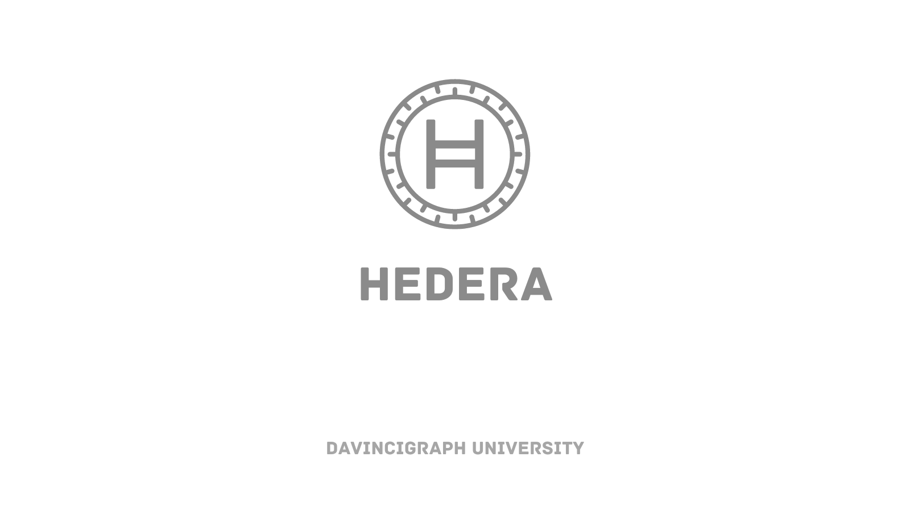

# What is Hedera?

Hedera Hashgraph is a type of technology used for making digital transactions, kind of like when you send money to someone online or buy something with a credit card. But it's not just for money, it can also be used for things like voting, keeping track of information, managing supply chains, where companies need to keep track of products as they move from place to place, or for recording the ownership of digital assets like virtual real estate in online games.

## Key Advantages

- **Speed**: Capable of processing thousands of transactions per second (TPS).
- **Security**: Uses asynchronous Byzantine Fault Tolerance (aBFT), the strongest form of security achievable in distributed consensus.
- **Fairness**: Ensures fair transaction ordering without the risk of front-running.
- **Scalability**: Designed to support a vast number of transactions without compromising on speed or security.

[Next: Consensus and Governance](02-consensus-and-governance.md)
