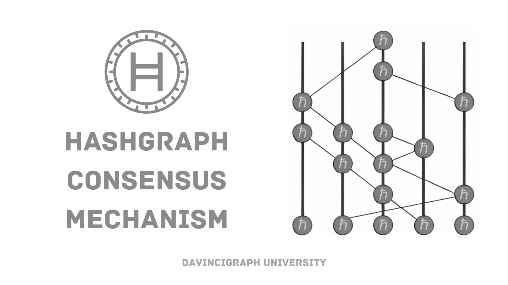
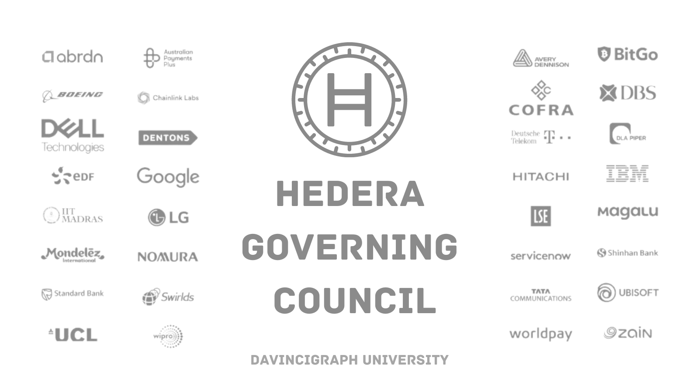

# Consensus and Governance in Hedera

Hedera stands out not just for its technology but also for its unique approach to consensus and governance.

## Consensus Mechanism

Imagine you're in a big group chat with a bunch of friends. Whenever someone sends a message, they tell it to a few random friends, who then tell it to a few more friends, and so on. This creates a web of connections where everyone eventually knows what's going on.

Now, in Hashgraph, instead of messages, we're talking about transactions like sending cryptocurrency or voting on something. Each transaction gets shared with a bunch of computers in the network. These computers share the transaction with other computers they're connected to, forming a "hashgraph" of information.

Here's the clever part: Hashgraph doesn't just look at the most recent transactions. It also looks back at the history of how information spread. By doing this, it can quickly and securely figure out which transactions are valid and should be added to the official record.

So, in simple terms, Hedera's consensus mechanism, Hashgraph, works like a big group chat where transactions are shared and tracked through a web of connections to quickly and securely verify which transactions are legit.

## Governing Council

The Hedera Governing Council is like a group of important people who make decisions about how a particular technology called Hedera Hashgraph works.

This council is made up of big companies and organizations from different industries. They come together to make decisions about the rules, changes, and improvements to the technology. They ensure that everything runs smoothly and fairly for everyone who uses Hedera Hashgraph.

Understanding these mechanisms is crucial for grasping how Hedera maintains its integrity and efficiency as a distributed ledger.

[Previous: What is Hedera?](01-what-is-hedera.md) [Next: Use Cases](03-use-cases.md)
