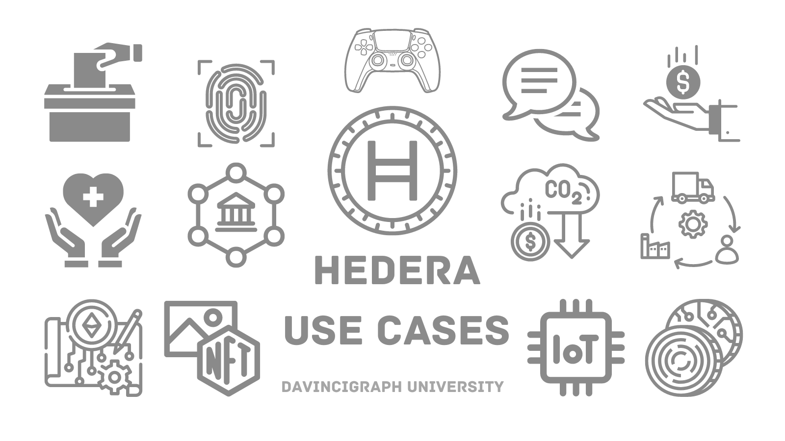

# Hedera in the Real World

Hedera Hashgraph's tech is super useful in lots of different fields. It works well and gets used in many industries because it can do a bunch of different things and it does them really efficiently.

## Key Use Cases

- **Finance**: For quick and secure cross-border payments.
- **Healthcare**: It can help in securely managing and sharing healthcare data, ensuring patient privacy while allowing for efficient access by authorized parties.
- **Decentralized Finance (DeFi)**: It's used for creating decentralized financial applications like lending, borrowing, and trading without relying on traditional banks.
- **Supply Chain Management**: Companies use it to track products from creation to delivery, ensuring transparency and security in the supply chain.
- **Gaming**: Game developers utilize it for creating secure and fair gaming environments where in-game assets can be securely traded.
- **Non-Fungible Tokens (NFTs)**: can be used to create, trade, and manage NFTs, which are unique digital assets representing ownership of digital or physical items such as art, collectibles, music, and virtual real estate.
- **Identity Verification**: It helps in verifying identities securely, which is crucial for various applications like voting systems, passport verification, and more.
- **Tokenization**: It allows for the creation of digital tokens representing real-world assets like property, stocks, or commodities, making them easier to trade and manage.
- **Internet of Things (IoT) Data Integrity**: It can ensure the integrity and security of data generated by IoT devices, allowing for trusted communication and interactions between devices.
- **Voting Systems**: It can be used to create secure and transparent voting systems, ensuring the integrity of elections and decision-making processes.
- **Decentralized Autonomous Organizations (DAOs)**: It can be utilized to create and manage DAOs, which are organizations run by smart contracts and governed by the votes of their members, ensuring transparency and fairness in decision-making.
- **Intellectual Property Protection**: It can be used to timestamp and authenticate intellectual property such as patents, trademarks, and copyrights, providing a tamper-proof record of ownership and creation.
- **Secure Messaging and Communication**: It enables the creation of secure messaging and communication platforms where users can exchange messages and data without the risk of interception or tampering.
- **Token-based Incentive Programs**: Organizations can use Hedera Hashgraph to create token-based incentive programs to reward users for participating in specific activities such as surveys, referrals, or loyalty programs.
- **Carbon Credits and Environmental Impact Tracking**: Hedera Hashgraph can facilitate the trading and tracking of carbon credits and other environmental assets, helping to incentivize sustainable practices and reduce carbon emissions.

Each industry benefits from Hedera's scalability, speed, and security, paving the way for innovative solutions previously thought impractical.

[Previous: Consensus and Governance](02-consensus-and-governance.md) [Next: Hedera vs. Traditional Blockchains](04-comparison-to-blockchain.md)
