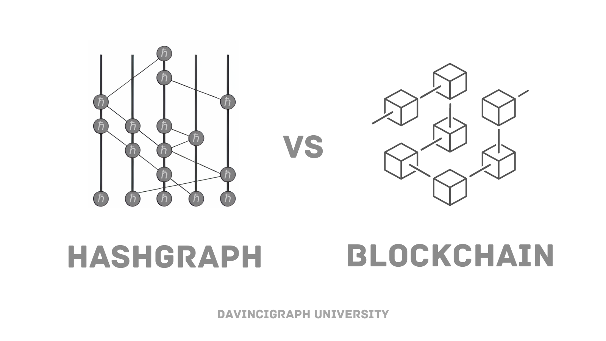

# Hashgraph vs Blockchain

Understanding how Hedera differs from traditional blockchain technology is essential to appreciating its innovative approach to distributed ledger technology.

## Blockchain:

- Imagine a chain of blocks, where each block contains some information.
- Each block in the chain stores data and has a link to the previous block, creating a chronological sequence.
- This structure makes it secure because altering a block would require changing all subsequent blocks, which is practically impossible due to the decentralized nature of blockchains.
- Examples of blockchain technology include Bitcoin and Ethereum.

## Hashgraph:

- Picture a group of people in a room having a conversation.
- Instead of a chain of blocks, Hashgraph uses a different method where each person shares information with everyone else in the room.
- This information sharing happens rapidly and repeatedly, creating a network of interactions.
- Hashgraph records the exact order and timing of these interactions, making it very efficient and secure.
- It doesn't require 'mining' like blockchain, so it can be faster and consume less energy.

## Hashgraph VS Blockchain

| Feature              | Hashgraph                                            | Blockchain                                                              |
| -------------------- | ---------------------------------------------------- | ----------------------------------------------------------------------- |
| Consensus Mechanism  | Asynchronous Byzantine Fault Tolerant (aBFT)         | Proof of Work (PoW), Proof of Stake (PoS), etc.                         |
| Data Structure       | Directed acyclic graph (DAG)                         | Linear chain of blocks (linked list)                                    |
| Pruning              | None                                                 | Pruning of old blocks to maintain chain                                 |
| Efficiency           | 100% efficient                                       | Efficiency can vary depending on consensus mechanism and implementation |
| Throughput           | Limited only by bandwidth                            | Varies, typically slower than Hashgraph                                 |
| Scalability          | High                                                 | Limited, especially for public blockchains                              |
| Transaction Ordering | Fair and deterministic                               | May be influenced by miners' decisions                                  |
| Security             | Asynchronous BFT, mathematically proven              | Depends on consensus mechanism and network size                         |
| Energy Consumption   | Very low                                             | High (especially for PoW-based blockchains)                             |
| Cost                 | Inexpensive                                          | Can be costly due to energy and hardware requirements                   |
| Fairness             | Fair access, fair timestamps, fair transaction order | Depends on implementation and incentives for miners                     |
| Decentralization     | Decentralized, no single point of control            | Varies, some blockchains can be centralized due to mining concentration |

[Previous: Use Cases](03-use-cases.md) [Next: module-02-wallets-and-hbar](../module-02-wallets-and-hbar/README.md)
