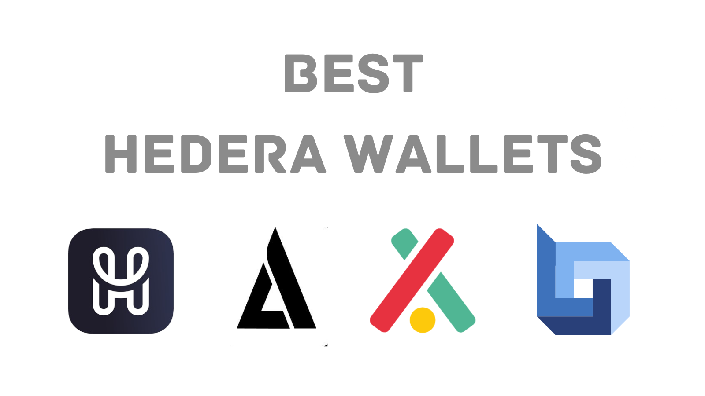

# Your Gateway to HBAR: Choosing a Hedera Wallet

When it comes to storing and managing your $HBAR (Hedera cryptocurrency), selecting the right wallet is crucial. Here's an overview of popular options on the Hedera network:

## HashPack

**A popular self-custody wallet known for its ease of use, strong security, and integration with Hedera dApps.**

## Blade

**Blade Wallet is a regularly security tested, self-custody wallet on Hedera. Blade Wallet is designed to be the most simple, seamless, and secure way to engage in Web3 activities on Hedera Network.**

## Kabila

**Kabila Wallet is a non-custodial user-friendly wallet for managing your HBAR and NFTs on the Hedera network. Kabila is the All-in-One NFT toolkit for Hedera.**

## Bank Social

**BankSocial is a self-custody crypto wallet and exchange. You can manage multiple cryptocurrencies (Bitcoin, Ethereum, Hedera, etc.), stake HBAR, and explore DeFi projects.**

## HashPack is The Top Choice for Hedera Enthusiasts

[HashPack](https://www.hashpack.app/) stands out as the premier wallet on the Hedera network for several reasons:

- **Simplicity**: Setting up and using HashPack is remarkably intuitive, even for those new to crypto.
- **NFT Support**: View, manage, and even trade NFTs directly within HashPack.
- **Security**: Features like biometric security, two-factor authentication, and integration with hardware wallets provide robust protection for your assets. HashPack has been independently audited by Quantstamp, a leading auditing firm specializing in web3 software.
- **Cold Wallet Compatibility**: HashPack integrates seamlessly and securely with cold wallets like Ledger, D'CENT, and Citadel wallet.
- **dApp Connectivity**: HashPack seamlessly connects with the most popular dApps (decentralized applications) on Hedera, giving you access to staking, Dexes, NFT marketplaces, and more.
- **Top-Notch Team**: The HashPack development team is highly respected in the Hedera community, known for their commitment to innovation and excellent support.
- **Frequent Updates**: HashPack receives regular updates, ensuring you're always ahead of the curve with new features and enhancements.

If you're looking for the most reliable, user-friendly, and actively supported wallet for your HBAR holdings,
👑 HashPack is the clear winner.

[Previous: What is HBAR (ℏ)?](01-what-is-HBAR.md) [Next: Setting Up Wallet](03-setting-up-wallet.md)
