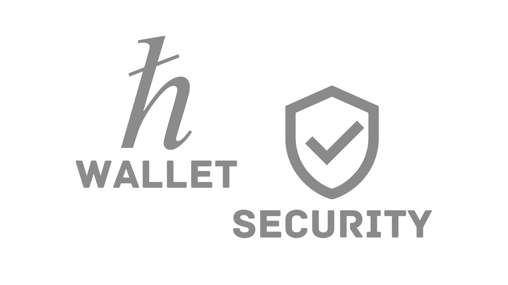

# Crypto Wallet Security

Cryptocurrencies offer exciting potential, but safeguarding your investments is paramount. With crypto theft on the rise, understanding wallet security is more crucial than ever.

## Types of Crypto Wallets

- **Hot Wallets:** Online wallets connected to the internet for convenience (e.g., exchange wallets, web wallets). While accessible, they're more vulnerable to hacks.
- **Cold Wallets:** Offline storage for enhanced security (e.g., hardware wallets, paper wallets). These are less convenient for frequent trading but ideal for long-term holding.

## Essential Security Practices

- **Strong Passwords:** Create complex, unique passwords for each wallet and exchange account. Use a password manager for secure storage.
- **Two-Factor Authentication (2FA):** Add an extra layer of security with 2FA, requiring a code or biometric authentication on top of your password.
- **Reputable Wallets:** Stick to well-known wallets from trusted providers. Research user reviews and security track records.
- **Software Updates:** Keep your wallet software up-to-date to benefit from the latest security patches.
- **Safeguard Private Keys:** Never share your private keys with anyone. These are the ultimate 'password' to your crypto assets.
- **Offline Backups:** Store offline backups of your wallet and recovery seed phrases in secure locations, such as fireproof safes.

## Additional Tips

- **Beware of Phishing Scams:** Be wary of suspicious emails or websites mimicking legitimate exchanges or wallets. Don't click on unfamiliar links.
- **Secure Your Devices:** Use antivirus/antimalware software on devices you use for crypto activities.
- **Avoid Public Wi-Fi:** Never access crypto wallets on public Wi-Fi networks, which can be compromised.

## The Importance of Cold Storage

For significant holdings, consider hardware wallets as the most secure option. They store your private keys offline, offering strong protection against online threats.

## Setup Your Cold Wallets

- [Setup Your Ledger Cold Wallet](https://www.hashpack.app/post/set-up-your-ledger-with-hashpack)
- [Setup Your D'CENT Cold Wallet](https://userguide.dcentwallet.com/external-service/connect-with-hashpack-wallet-extension-including-hbar-native-staking)
- [Setup Your Citadel Cold Wallet](https://docs.citadelwallet.io/getting-started/pair-with-hashpack)

## Remember: You Are Responsible

Unlike traditional banks, there's no central authority to recover lost crypto if your wallet is compromised. By prioritizing security, you can protect your hard-earned cryptocurrency investments.

[Previous: Buying HBAR](./04-buying-hbar.md) [Next: module-03-defi-on-hedera](../module-03-defi-on-hedera/README.md)
