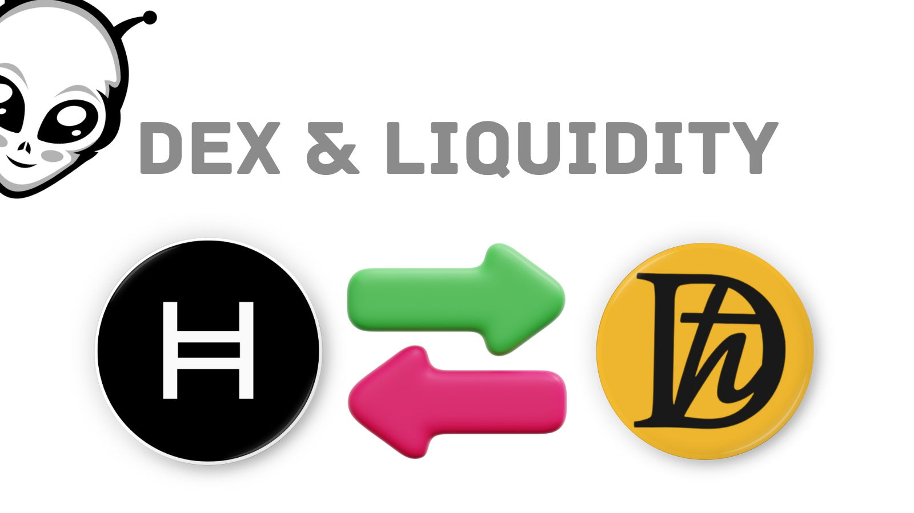

# Understanding Decentralized Exchanges (DEXs) and Liquidity

Today, we're going to talk about two important concepts in the world of decentralized finance (DeFi): **Decentralized Exchanges (DEXs)** and **liquidity**.

## Decentralized Exchanges (DEXs)

Imagine you want to trade your favorite cryptocurrencies without relying on a central authority, like a traditional stock exchange. That's where DEXs come in! They are digital platforms that allow you to buy, sell, or swap cryptocurrencies directly from your wallet, without the need for intermediaries. Pretty cool, right?

## Liquidity

Now, let's move on to liquidity. In the context of DEXs, liquidity refers to the ease with which you can buy or sell a cryptocurrency without significantly affecting its price. It's like having a big pool of coins readily available for trading. The more liquidity a DEX has, the smoother and faster your trades will be.

But how do DEXs ensure they have enough liquidity? That's where **liquidity providers** come into play. These are individuals or organizations that contribute their cryptocurrencies to the DEX's liquidity pools. In return, they earn a portion of the trading fees generated by the platform. It's a win-win situation: liquidity providers earn passive income, and traders benefit from a more efficient and stable trading experience.

### Automated Market Maker (AMM)

One of the most popular types of DEXs is the **Automated Market Maker (AMM)**. AMMs use smart contracts to automatically set the prices of cryptocurrencies based on the ratio of tokens in the liquidity pools. This means that you don't need to wait for a buyer or seller to match your order; the AMM takes care of it instantly. Some well-known AMM-based DEXs include Uniswap, SushiSwap, PancakeSwap, and SaucerSwap.

So, there you have it! DEXs and liquidity are essential components of the DeFi ecosystem, enabling users to trade cryptocurrencies securely and efficiently without relying on centralized authorities. By understanding these concepts, you're well on your way to becoming a savvy DeFi user.

Remember, always do your own research and exercise caution when participating in any DeFi platform.

Happy trading, and may your investments be profitable!

[Previous: Wallets & HBAR](../module-02-wallets-and-hbar/README.md) [Next: Staking & Farming](./02-staking-and-farming.md)
