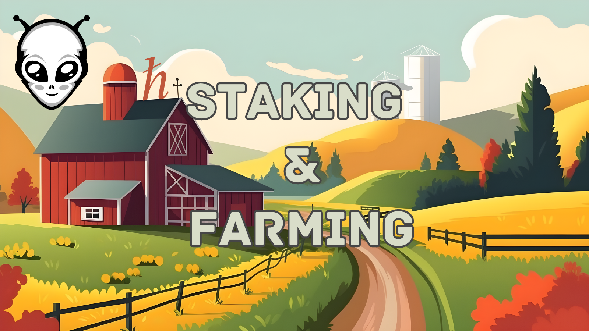

# Understanding Staking and Farming

## What is Staking?

Staking is the process of actively participating in transaction validation (similar to mining) on a proof-of-stake (PoS) blockchain. By holding or "locking up" a certain amount of tokens, you're essentially supporting the network's security and operations. In return, you earn rewards, usually in the form of additional tokens. It's a great way to help maintain the blockchain's integrity while growing your crypto holdings.

### How to Stake HBAR

[HBAR](https://www.hedera.com/) is the native cryptocurrency of the Hedera Hashgraph, a high-performance blockchain. If you're interested in staking HBAR, a useful guide has been provided by HashPack, a user-friendly crypto wallet. This tutorial takes you through the steps to start staking HBAR with HashPack.

- [Stake HBAR Tutorial](https://www.hashpack.app/post/staking-with-hashpack)

## What is Farming?

Farming, or yield farming, involves lending your crypto assets to others through the magic of smart contracts. In return, you earn fees or interest in the form of cryptocurrency. Farming can be riskier than staking because it often involves more complex strategies and a deeper understanding of the market. However, it can also be more rewarding.

### Getting Started with Farming on SaucerSwap

SaucerSwap is a decentralized platform that allows for yield farming and single-side staking. Here are some tutorials to help you get started:

#### SAUCE Single Side Staking

For those holding SAUCE tokens, single-side staking is a simpler form of farming allowing you to earn rewards by staking just one kind of token.

- [Watch SAUCE Single Side Staking Tutorial](https://www.youtube.com/watch?v=ava-9xUOxyk)

#### Farming on SaucerSwap

If you're ready to dive into more complex farming strategies, SaucerSwap provides opportunities to earn by providing liquidity.

- [Watch Farming on SaucerSwap Tutorial](https://www.youtube.com/watch?v=v66AZ9BdmAk)

Both staking and farming are excellent ways to participate more actively in the cryptocurrency universe, offering the chance to earn additional tokens for your efforts. Whether you're new to the scene or looking to expand your crypto activities, these methods provide avenues to grow your investments beyond traditional buying and selling. Remember, while the potential for rewards is significant, always consider the risks and do your research.

[Previous: Dexes & Liquidity](./01-dexes-and-liquidity.md) [Next: Understanding HTS](./03-understanding-hts.md)
