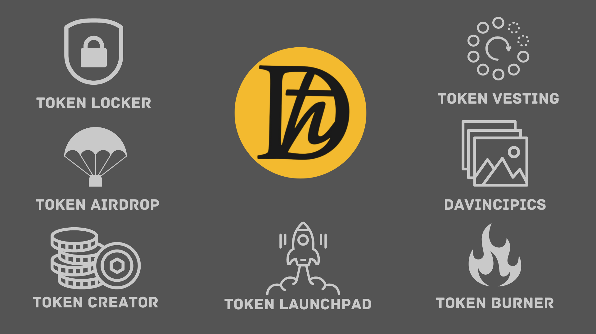

## DaVinciGraph: The Essential Token Management Solution on Hedera

DaVinciGraph empowers users within the Hedera ecosystem with a comprehensive token management suite, streamlining the process of creating, customizing, and securing Hedera Token Service (HTS) tokens.

**Services:**

- **[Token Management:](https://davincigraph.io/devs/tokens/create)** Allows you to Create, Mint, Delete, Wipe, Burn, Freeze , and Update Your HTS Token with few clicks
- **[Token/LP/NFT Locker:](https://davincigraph.io/devs/locks/new)** Token Locker service allows you to Lock Tokens for a set period.
- **[Token Burner:](https://davincigraph.io/devs/burns/new)** Token Burner service allows you to Burn Tokens with out
  Admin key.
- **[Token Vesting:](https://davincigraph.io/devs/vestings/new)** Token Vesting service allows you to schedule the gradual release of tokens over a period of time.
- **[DaVinciPics:](https://davincigraph.io/devs/pics/tokens)** Manages token logos within the Hedera ecosystem, simplifying the process for token creators and DApp developers.

**Upcoming Services**

- **Token Airdrop:** Distribute tokens to your community efficiently.
- **Token Launchpad:** Facilitate the launch of new tokens.

**[DAVINCI Token](https://www.saucerswap.finance/swap/HBAR/0.0.3706639)**

The DAVINCI token fuels the DaVinciGraph ecosystem:

- **Name:** Davincigraph
- **Symbol:** DAVINCI
- **Token ID:** 0.0.3706639
- **Max Supply:** 90,000,000
- **Decimals:** 9
- **Keyless:** No controlling keys exist

**DAVINCI Token Utility:**

- **Essential for Services:** DAVINCI is required for DaVinciGraph's token management and DaVinciPics.
- **Discounted Fees:** Pay for locker, burner, and vesting services using a blend of HBAR and DAVINCI, and receive a 25% discount when utilizing DAVINCI.

**DAVINCI Token Airdrops and Revenue Sharing**

**Airdrop for DaVinciGraph NFT Holders**

- 10M DAVINCI token airdrop for NFT holders
- 5M DAVINCI Ultra Airdrop for set/bulk NFT holders

**NFT Tier Breakdown:**

- **[Bronze:](https://sentx.io/nft-marketplace/davincigraph-bronze-nfts)** 3000 NFTs, 1000 DAVINCI airdrop each, 5% revenue share
- **[Silver:](https://sentx.io/nft-marketplace/davincigraph-silver-nfts)** 2000 NFTs, 2000 DAVINCI airdrop each, 5% revenue share
- **[Gold:](https://sentx.io/nft-marketplace/davincigraph-gold-nfts)** 1000 NFTs, 3000 DAVINCI airdrop each, 5% revenue share

**Airdrop Schedule**

DAVINCI Token Regular Airdrop for each NFT + Ultra Airdrop Schedule:

- 1/10 Aug 2024
- 2/10 Nov 2024
- 3/10 Feb 2025
- 4/10 May 2025
- 5/10 Aug 2025
- 6/10 Nov 2025
- 7/10 Feb 2026
- 8/10 May 2026
- 9/10 Aug 2026
- 10/10 Nov 2026

**Let's Get Started!**

To dive deeper into DaVinciGraph, explore our [website](http://davincigraph.io/). We can't wait to see what you'll create and manage with our powerful suite of tools!

[Previous: DeFi on Hedera](../module-03-defi-on-hedera/README.md) [Next: Token Creation Basics](./02-token-creation-basics.md)
