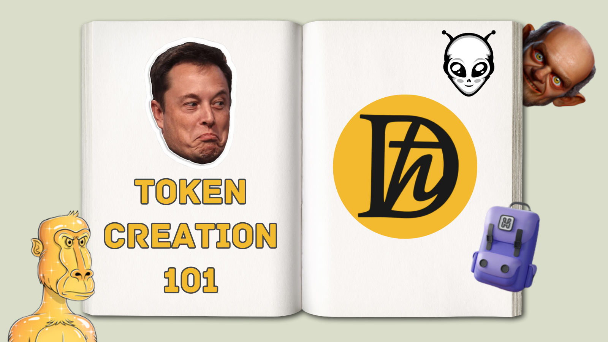

# Token Creation 101

Creating a token is a comprehensive process that requires careful planning and execution. This guide is designed to take you through the foundational steps to the more advanced considerations involved in launching a successful token.

## Purpose and Use Case

- **Identify the Problem and Value**: Consider why your token exists. What unique problem does it solve, and how does it improve the experience for its users? A well-defined purpose helps you craft a token that people actually want to use.

- **Benefits and Target Audience**: Clarify what users gain from your token. Is it about earning rewards, participating in governance, or unlocking special content? Knowing who your audience is and what they value sets the direction for your project.

- **Market Research**: Investigate similar tokens to understand what works and what doesn’t. This can give you insights into how to position your own token for success.

## Tokenomics

- **Supply and Distribution**: Decide how many tokens will be created and how they will be distributed among users. The right balance can encourage user engagement and investment.

- **Pricing Strategy**: Plan how your token will be priced initially and what factors might affect its value over time. This involves thinking critically about supply and demand, and how you can ensure the token remains valuable.

- **User Incentives**: Define what will motivate people to buy, hold, or sell your token. Consider mechanisms like token burning, which can reduce supply and potentially increase value, to maintain a healthy economy around your token.

## Legal and Regulatory Compliance

- **Understand the Legal Landscape**: Dive into the regulatory requirements affecting your token. Laws differ widely by region and can have significant implications for your project.

- **Ensure Compliance**: Align your project with all relevant laws to avoid legal pitfalls. This might involve adapting your strategy to fit regulations related to securities, taxes, and consumer protection.

- **Obtain Licenses and Permissions**: Secure the necessary legal backing to operate without friction in your chosen jurisdictions.

## Team and Partnerships

- **Build a Diverse Team**: Gather a group of professionals with diverse skills in blockchain technology, marketing, and finance. A well-rounded team is crucial for navigating the complexities of launching a token.

- **Foster Strategic Partnerships**: Seek alliances with established entities in the crypto world. Partners can provide valuable resources, exposure, and credibility to your project.

## Community Building and Marketing

- **Develop a Marketing Strategy**: Craft a plan that uses various channels to spread the word about your token. Effective marketing can build anticipation and attract early adopters.

- **Engage with Your Community**: Create opportunities for dialogue and feedback through regular updates and interactive sessions like AMAs (Ask Me Anything). This can boost loyalty and provide valuable insights into user needs.

- **Community Incentives**: Reward community members who contribute positively to your project. Incentives can foster a vibrant and supportive ecosystem around your token.

## Token Liquidity and Listing

- **Strategize for Liquidity**: Ensure your token can be easily bought and sold. Liquidity is key to a successful token as it impacts user experience and perception of value.

- **Exchange Listing**: Getting your token listed on reputable exchanges can significantly impact its visibility and accessibility. Comply with listing requirements to achieve this goal.

## Roadmap and Development

- **Outline Your Roadmap**: Provide a clear timeline of milestones and goals. A roadmap communicates your commitment to the project’s growth and helps manage expectations.

- **Adopt a Robust Development Strategy**: Plan for ongoing improvement, including technical updates and new features. Stay responsive to community feedback and evolving market needs.

- **Continuous Improvement**: Embrace innovation and adaptability as core principles. Stay ahead of technological advancements to keep your token relevant.

## Disaster Recovery and Business Continuity

- **Plan for the Unexpected**: Develop strategies for dealing with unforeseen challenges. Having a plan in place ensures your project can continue operating smoothly under any circumstances.

- **Align Planning with Goals**: Make sure your disaster recovery and continuity plans are in harmony with the broader objectives of your token.

## Partnerships and Collaborations

- **Accelerate Growth**: Identify potential partners that share your vision. Collaborative efforts can speed up adoption and enhance the ecosystem around your token.

- **Strategic Integration**: Build partnerships thoughtfully to ensure they bring tangible benefits and align with long-term goals.

## Token Branding and Identity

- **Build Your Brand**: Create a strong, identifiable brand for your token. A compelling branding strategy can make your token stand out in a crowded market.

- **Consistent Messaging**: Use a cohesive voice and message across all platforms. This helps build trust and recognition for your token.

## Continuous Improvement and Innovation

- **Encourage Experimentation**: Promote a culture where trying new ideas is valued. Innovation is essential for staying relevant and addressing the changing needs of the market.

- **Community Feedback**: Actively seek and incorporate user feedback. Engaging with your community can reveal opportunities for improvement and innovation.

## Token Holder Incentives and Rewards

- **Incentivize Engagement**: Create a rewards program that encourages users to participate actively and hold onto your token. This can boost loyalty and provide long-term stability.

- **Align Incentives with Goals**: Ensure that the rewards and incentives you offer are in line with your project’s objectives and sustainable for its future.

Adhering to these guidelines will help you navigate the token creation process more effectively, from conceiving an idea to launching a token that is valued by users and stands the test of time.

[Previous: DaVinciGraph](./01-davincigraph.md) [Next: Creating Tokens With DaVinciGraph](./03-creating-tokens-with-davincigraph.md)
