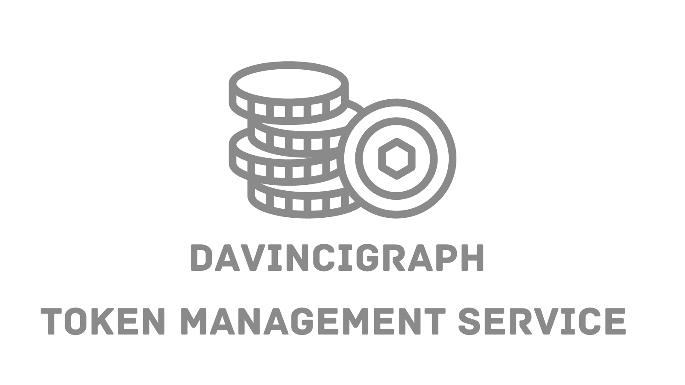

# Creating Tokens with DaVinciGraph

In this guide, we'll walk you through the process of creating your own tokens using DaVinciGraph. This platform provides a straightforward, user-friendly interface for token creation.

## Benefits of Using DaVinciGraph Token Management Service

### No Coding Required

One of the standout benefits of DaVinciGraph is that it doesn't require any coding knowledge. You don't need to be a developer to create your tokens. The platform is designed to be non-technical and accessible for all users.

### No Developer Required

Since no coding is necessary, you also don't need to hire a developer. This makes the process more accessible and cost-effective, allowing you to focus your resources on other aspects of your project.

### Easy to Use

DaVinciGraph offers an extremely user-friendly interface. The token creation process is broken down into clear, manageable steps, making it easy for anyone to follow along and create tokens without confusion.

### Cost-Effective

Creating tokens on DaVinciGraph is not only easy but also inexpensive. The platform is designed to reduce the financial barriers to entry, making token creation accessible for projects of all sizes.

### Customizable Options

Despite its simplicity, DaVinciGraph offers a range of customization options. You can define various parameters for your token, such as name, symbol, initial supply, and more, to ensure it meets your specific requirements.

## Step-by-Step Tutorial

For a detailed, step-by-step video tutorial, head over to [this YouTube link](https://www.youtube.com/watch?v=fOb6XsQ69j0). This video will guide you through every step of the token creation process.

## Token Creator Page

You can start creating your tokens by visiting the [Token Creator page on DaVinciGraph](https://davincigraph.io/devs/tokens/create). This page offers all the necessary tools and options you'll need.

The token creation process is both intuitive and customizable, allowing you to define various parameters and properties of your token.

DaVinciGraph simplifies the process of creating tokens, making it accessible to everyone, regardless of technical expertise. Its cost-effectiveness, user-friendly design, and lack of required coding knowledge make it an ideal choice for anyone looking to create tokens quickly and efficiently.

Happy token creation!

[Previous: token-creation-basics](./02-token-creation-basics.md) [Next: listing-your-token-on-SaucerSwap.md](./04-listing-your-token-on-SaucerSwap.md)
