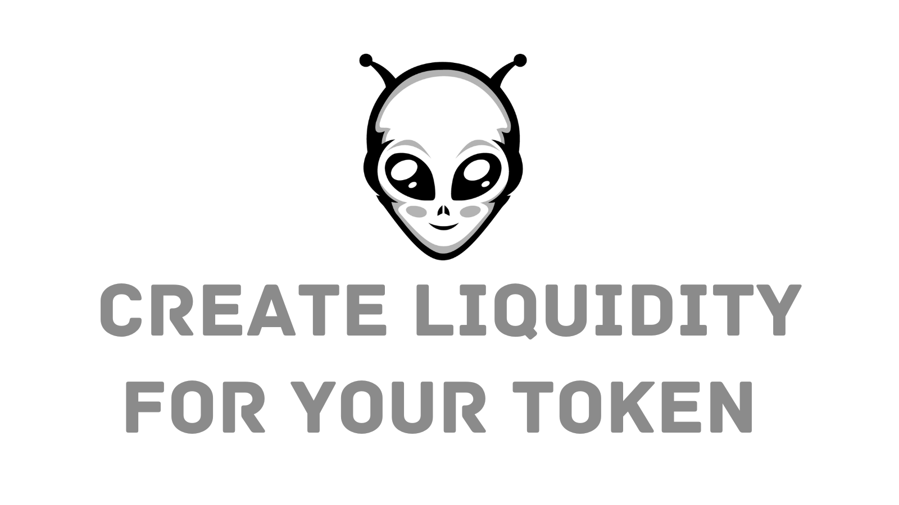

# Listing Your Token on SaucerSwap

## Introduction to SaucerSwap

SaucerSwap is a decentralized exchange (DEX) that allows users to trade tokens directly from their wallets. Unlike centralized exchanges (CEXs), SaucerSwap offers significant advantages for token creators and traders:

- **Decentralization**: Users retain control over their funds, as trades are executed directly from their wallets.
- **Lower Costs**: Listing on SaucerSwap can be more budget-friendly compared to CEXs.
- **No Central Authority**: Transactions are managed by smart contracts, reducing the risk of censorship or intervention.

## Benefits of Listing on SaucerSwap

Listing your token on a centralized exchange can be prohibitively expensive, often costing a minimum of $120,000. In stark contrast, listing on SaucerSwap is much more affordable, with costs depending on your liquidity budget. It's possible to start with as little as $100, although providing more liquidity is highly recommended. By providing a larger liquidity pool, you can attract more traders, improve price stability, and generate better trading volumes. This can lead to increased visibility and credibility for your token.

Additional benefits include:

- **Increased exposure**: By listing on SaucerSwap, you can reach a global audience of traders and investors who are looking for new, innovative tokens to buy and sell.
- **Improved liquidity**: As more traders and investors join the platform, your token's liquidity will increase, making it easier to buy and sell.
- **Reduced counterparty risk**: With SaucerSwap, you don't have to worry about the counterparty risk associated with trading on a centralized exchange.
- **Increased control**: You have full control over your token's liquidity, allowing you to make changes as needed.
- **Faster transaction times**: Trades are executed quickly and easily on SaucerSwap, reducing the time it takes to buy and sell your token.

## Guide to Listing Your Token

For an in-depth guide, follow the official [SaucerSwap V1 liquidity tutorial](https://docs.saucerswap.finance/get-started/saucerswap-tutorials/liquidity/saucerswap-v1).

Listing your token on SaucerSwap is a cost-effective, straightforward process that offers numerous benefits over traditional centralized exchanges. By providing sufficient liquidity, you can enhance your token's market presence and trading activity.

[Previous: creating-tokens-with-davincigraph](./03-creating-tokens-with-davincigraph.md) [Next: managing-token-logo-with-DaVinciGraph](./05-managing-token-logo-with-DaVinciGraph.md)
