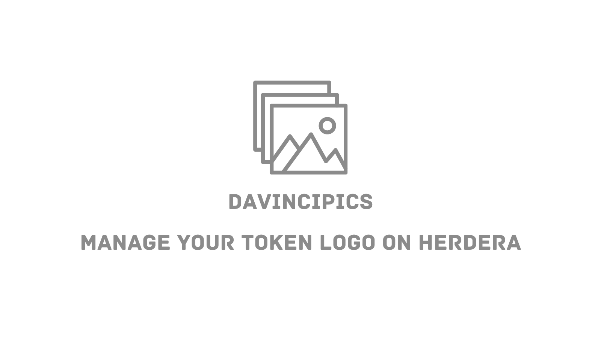

# Managing Token Logos with DaVinciPics

## What is DaVinciPics?

DaVinciPics is a powerful tool designed to streamline the process of managing token logos within the Hedera ecosystem. By allowing token creators to upload their token logos just once, DaVinciPics ensures consistent and universal representation across all decentralized applications (DApps). This not only improves efficiency but also enhances the brand identity of tokens.

### For Token Creators

Token creators are constantly seeking ways to stand out in the crowded digital marketplace. DaVinciPics addresses this need by simplifying the process of token logo management. With DaVinciPics, creators can:

- **Upload Once, Reflect Everywhere:** Upload their token logos once to ensure a consistent visual representation across all DApps in the Hedera ecosystem.
- **Enhance Brand Identity:** Maintain a consistent brand identity with minimal effort.
- **Dynamic Theme-Switching:** Take advantage of theme-switching capabilities to update logos dynamically for special occasions or seasons, boosting visual engagement and recognition.

_Example:_ Imagine the Grelf token changing its logo for holiday seasons, instantly reflected across all DApps using DaVinciPics. This feature adds a layer of visual allure and branding versatility that is crucial in today's market.

### For DApp Developers

For DApp developers, the integration of token logos can be a cumbersome and time-consuming process. DaVinciPics offers a streamlined solution that minimizes this burden. With DaVinciPics, developers can:

- **Quick Integration:** Implement comprehensive logo management for all tokens in just five minutes.
- **Save Resources:** Free up valuable development resources to focus on enhancing other aspects of their DApps.

## Video Tutorials

To get a better understanding of DaVinciPics and how it can be used, watch the following videos:

- **[What is DaVinciPics?](https://www.youtube.com/watch?v=Ff9r52aVawk)**

- **[Managing Your Token Logo](https://www.youtube.com/watch?v=t8ZZzz6KBHw)**

## DaVinciPics Pages

- **Check Token Logos:** View a list of tokens and their logos on [DaVinciPics](https://davincigraph.io/devs/pics/tokens/list).
- **Manage Your Token Logo:** Easily manage and update your token logos using [DaVinciPics](https://davincigraph.io/devs/pics/tokens).

DaVinciPics revolutionizes the way token creators and DApp developers manage and integrate token logos. By providing a centralized and straightforward solution, it enhances efficiency, consistency, and brand visibility within the Hedera ecosystem.

[Previous: listing-your-token-on-SaucerSwap](./04-listing-your-token-on-SaucerSwap.md) [Next: locking-LP-tokens-using-DaVinciGraph](./06-locking-LP-tokens-using-DaVinciGraph.md)
