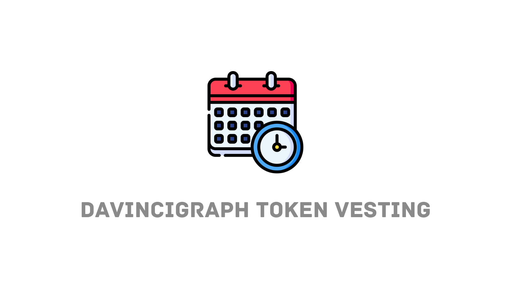

# Token Vesting Schedules with DaVinciGraph

Token vesting is a mechanism used in blockchain and cryptocurrency projects to control the release of tokens over a specified period. Initially, tokens are locked in a smart contract and are gradually released to the intended recipients according to predefined rules. This process ensures that stakeholders, such as team members, advisors, and early investors, receive their tokens incrementally rather than all at once.

### Benefits of Using DaVinciGraph for Token Vesting

Implementing token vesting schedules can be vital for the long-term success of a blockchain project. DaVinciGraph enhances this process with several key benefits:

- **Increased investor trust:** Vesting schedules ensure that tokens are distributed gradually, preventing sudden large sales that could negatively impact the token's price and market stability.
- **Team motivation:** Vesting schedules for team members and advisors align their incentives with the long-term success of the project, promoting sustained contributions and commitment.
- **Preventing Pump and Dump:** By controlling the release of tokens, vesting schedules mitigate risks associated with “pump and dump” schemes, where early investors may liquidate large quantities quickly.
- **Transparency and Compliance:** DaVinciGraph's platform allows for transparent and publicly verifiable vesting schedules, enhancing trust among all stakeholders and ensuring adherence to regulatory recommendations.

_Example:_ A new blockchain project might set up a vesting schedule using DaVinciGraph that releases tokens to the development team over three years. This encourages ongoing development and reduces the chances of team members abandoning the project early.

For a comprehensive guide on how to use Token Vesting, watch the following video:

- **[Creating Token Vesting Schedules with DaVinciGraph](https://www.youtube.com/watch?v=wpxg2x1IJEU)**

For more information and to view existing vesting schedules, visit these resources:

- **Check Vestings:** Browse currently active and past vesting schedules on [DaVinciGraph](https://davincigraph.io/devs/vestings).
- **Schedule Your Vesting:** Start creating your vesting schedule [here](https://davincigraph.io/devs/vestings/new).

By leveraging DaVinciGraph to implement token vesting schedules, project developers can ensure a balanced and trustworthy token distribution system, laying the groundwork for sustained project success and robust investor confidence.

[Previous: locking-LP-tokens-using-DaVinciGraph](./06-locking-LP-tokens-using-DaVinciGraph.md) [Next: burning-tokens-with-DaVinciGraph](./08-burning-tokens-with-DaVinciGraph.md)
