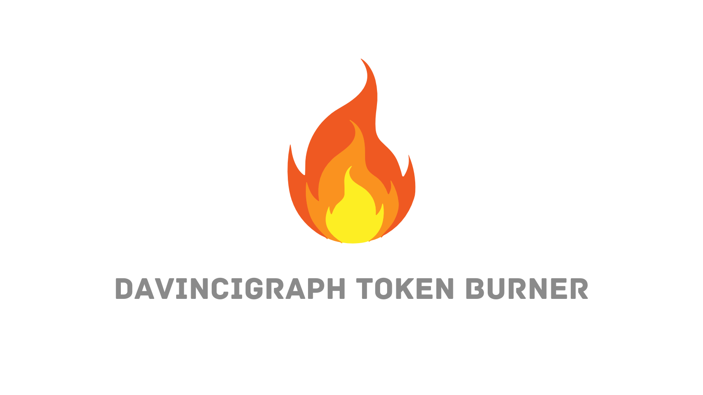

# Burning Tokens with DaVinciGraph

## What is Token burning?

Token burning is the process of permanently removing a certain number of tokens from circulation. This is achieved by sending the tokens to a burn address, a special SmartContract: DaVinciGraph Black Hole from which they can never be retrieved or used again.

### Benefits of Burning Tokens Using DaVinciGraph

- **Supply Management:** Burning tokens permanently removes them from circulation, helping to reduce total supply and potentially increase the value of remaining tokens.
- **Market Confidence:** Demonstrating a transparent and verifiable burning process can bolster investor confidence, as it shows the project’s commitment to sustainable growth.
- **Inflation Control:** By reducing the circulating supply of tokens, burning can act as a deflationary mechanism, counteracting inflationary pressures.
- **Increased Scarcity:** Token burning creates scarcity, which can drive demand and contribute to the token's perceived value over time.

_Example:_ A token project may burn a portion of its tokens to reduce supply and signal to investors that it is taking active steps to manage inflation and increase token value.

Burning tokens through DaVinciGraph is designed to be easy and accessible for all project developers.

- **Start the token burning process by visiting** [this link](https://davincigraph.io/devs/burns/new).

For a detailed guide on how to use the burning service, watch the following video:

- **[DaVinciGraph Token Burner Service](https://www.youtube.com/watch?v=9Lr72yiiuaQ)**

To see examples of burned tokens and liquidity, visit the following resources:

- **Check Burned Tokens:** View a list of burned tokens on [DaVinciGraph](https://davincigraph.io/devs/burns/tokens).
- **Check Burned Liquidities:** Review burned liquidity tokens using [DaVinciGraph](https://davincigraph.io/devs/burns/liquidities).

Happy Burning!

[Previous: token-vesting-schedules-with-DaVinciGraph](./07-token-vesting-schedules-with-DaVinciGraph.md) [Next: module-05-community-and-marketing](../module-05-community-and-marketing/README.md)
