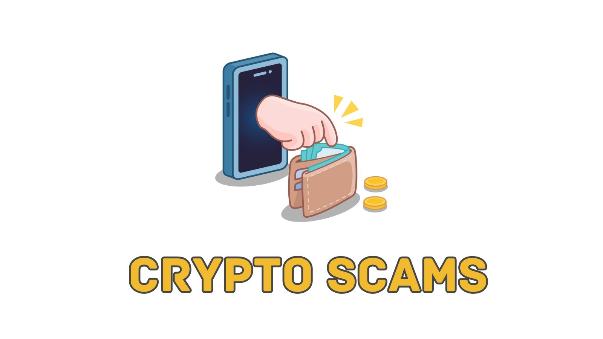

# Understanding Crypto Scams

Cryptocurrencies offer exciting opportunities for investment and innovation. However, the rapid growth of the crypto market has also attracted a slew of scammers looking to exploit unsuspecting individuals. Understanding these scams is the first step toward protecting yourself.

## What is a Crypto Scam?

A crypto scam involves fraudulent schemes that aim to steal your cryptocurrency or trick you into investing in a fake venture. Scammers are drawn to the crypto space because it is relatively new and can be complex, making it easier to deceive people.

## Common Types of Crypto Scams:

### Ponzi and Pyramid Schemes:

Scams that promise high returns with little risk to investors. New investor funds are used to pay earlier backers, creating a cycle that eventually collapses.

#### Example:

BitConnect was a notorious Ponzi scheme that promised investors high returns with minimal risk. The platform claimed to use trading bots to generate returns. After attracting millions of dollars, the platform collapsed, leading to significant financial losses for investors. BitConnect’s collapse saw losses estimated to exceed $1 billion, affecting investors worldwide.

### Fake ICOs (Initial Coin Offerings):

Fraudulent startups that present themselves as legitimate crypto projects to solicit investments, then disappear with the funds.

#### Example:

PlexCoin raised $15 million from investors by promising a 1,354% profit in less than a month. Regulatory agencies stepped in, revealing it as a scam.

### Phishing:

Scammers use emails, fake websites, or social media to trick you into revealing your private keys or login information.

#### Example:

A common phishing scam involves an email impersonating a well-known exchange, such as Binance, claiming there's an issue with your account and requesting you to log in via a provided link that leads to a fake site.

### Giveaway Scams:

Scammers pose as celebrities or influencers, promising to double your cryptocurrency if you send them an initial amount.

#### Example:

Fake Twitter accounts mimicking Elon Musk or other prominent figures have promoted fraudulent giveaways, tricking users into sending their cryptocurrency to a scammer’s address under the promise of receiving double the amount in return.

### Malware and Fake Wallets:

Software that looks like legitimate wallets but is designed to steal your cryptocurrency once you enter your private keys.

#### Example:

CryptoShuffler malware changed copied wallet addresses on a victim's clipboard, redirecting cryptocurrency transactions to the scammer’s wallet.

## Staying Safe

Staying safe from crypto scams requires being aware and informed. By learning about the different scams and how they work, you can protect your investments. Always do your research, be wary of offers that seem too good to be true, and trust only reliable sources. In the fast-changing world of cryptocurrency, these simple steps can help keep your money safe and make the crypto community safer for everyone.

[Next: Recognizing Red Flags in Crypto Investments](./02-recognizing-red-flags-in-crypto-investments.md)
