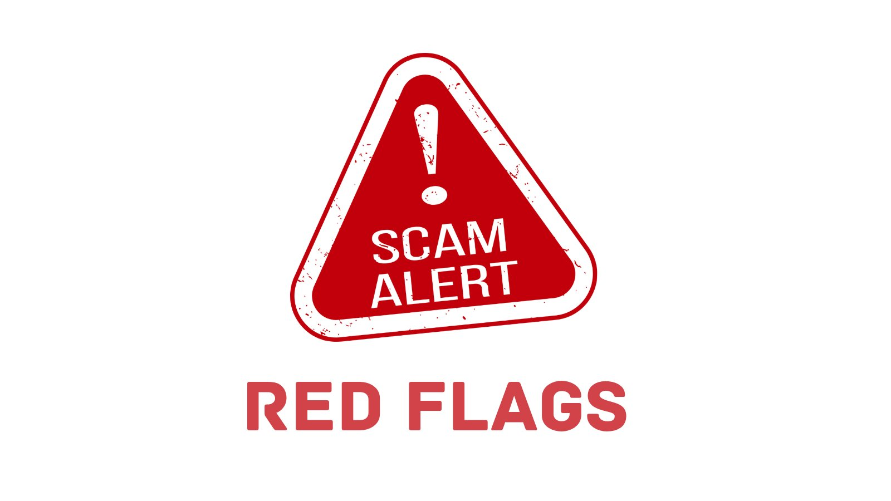

# Recognizing Red Flags in Crypto Investments

Let's look at how to recognize the red flags that often signal a scam. Identifying these warning signs can help you avoid potential losses and stay safe in the volatile world of cryptocurrencies.

## 1. Too Good to Be True:

### Ponzi Schemes:

#### Promise:

Investments offering consistently high returns with little or no risk are a major red flag.

#### Example:

An investment platform claims it can guarantee 10% daily returns on your investment.  
BitConnect promised high returns and attracted a large number of investors, only to collapse and leave many with significant losses.

### Fake Testimonials:

#### Tell-Tale Sign:

Glowing testimonials that seem scripted or overly positive.

#### Example:

A website filled with success stories that all sound similar and lack detail. For instance, a testimonial like "I invested $1,000 and made $10,000 in a month! Best decision ever!" without any verifiable proof.

## 2. Lack of Transparency:

### Legitimacy Check:

#### Key Indicators:

Reputable crypto projects disclose their team, whitepapers, and detailed roadmaps.

#### Example:

An ICO with no information about the team members or only providing vague project details. An infamous case is the PlexCoin ICO, which promised huge returns but provided scant details about its team and operations, eventually leading to fraud charges.

### Missing Whitepapers:

#### Key Document:

A whitepaper outlines the technology, purpose, and future plans of a project.

#### Example:

If a new cryptocurrency project doesn't have a detailed whitepaper or it seems copied from another project, this is a major red flag.

## 3. Phishing Attempts:

### Tactics:

Scammers create fake emails or websites that mimic well-known crypto exchanges or wallets.

#### Example:

You receive an email that looks like it's from Coinbase, asking you to log in via a provided link to secure your account. The link leads to a fake site designed to steal your credentials.  
Another example is a fake website that closely resembles MyEtherWallet, tricking users into entering their private keys.

### Social Media Scams:

#### Approach:

Fake social media profiles of crypto influencers asking for investments.

#### Example:

A Twitter account impersonating a known crypto influencer tweets about a special investment opportunity, providing a link that leads to a phishing site.

## 4. Unsolicited Offers:

### Beware of Random Messages:

#### Common Approach:

Legitimate investment opportunities don't typically come through unsolicited messages.

#### Example:

Receiving a direct message on Telegram or Twitter from someone claiming to be a financial advisor with an exclusive investment opportunity.  
For instance, a scammer posing as an advisor might message you on LinkedIn offering a high-return investment in a new crypto token.

### Fake Airdrops:

#### Red Flag:

Unsolicited notifications about receiving free tokens.

#### Example:

You get an email claiming you've been selected to receive a free airdrop of a new cryptocurrency, but you need to provide your wallet details or make a small payment first.

## 5. Fake Endorsements:

### Celebrity Scams:

#### Deceptive Tactic:

Scammers often create fake endorsements from celebrities or trusted figures to lure victims.

#### Example:

A fake news article or social media post claiming that Elon Musk is backing a new cryptocurrency.  
In 2020, a widespread scam used fake endorsements from celebrities like Bill Gates and Richard Branson to promote fraudulent Bitcoin giveaways.

### Misleading Partnerships:

#### False Claims:

Claims of partnerships with reputable companies or organizations.

#### Example:

A new crypto project claims it has a partnership with a major tech company like Microsoft or Google, but there's no official confirmation from the mentioned companies.  
The OneCoin scam falsely claimed partnerships with reputable firms to build credibility.

Always be skeptical of offers that seem too good to be true and conduct thorough research before investing. Awareness and vigilance are your best defenses against crypto scams.

Stay safe ⛑️

[Previous: Understanding Crypto Scams](./01-understanding-crypto-scams.md)

[Next: Essential Security Practices for Safe Crypto Transactions and Storage](./03-essential-security-practices-for-safe-crypto-transactions-and-storage.md)
