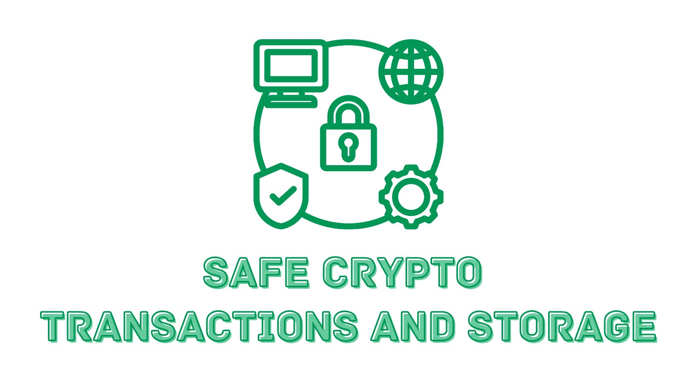

# Essential Security Practices for Safe Crypto Transactions and Storage

Today, we’re diving into the essential practices for securing your crypto transactions and storing your digital assets safely. Let’s ensure your cryptocurrencies are as secure as possible with practical steps and real-world examples.

## 1. Choosing a Secure Wallet

### Understanding Wallet Types:

**Hot Wallets:**
These are online wallets accessible via the internet. While convenient, they are more vulnerable to hacks.

**Example:**
A popular exchange like Coinbase offers a hot wallet which allows for quick transactions but should not be used to store large amounts of cryptocurrency.

**Cold Wallets:**
These are offline wallets, such as hardware or paper wallets, which are significantly more secure against online threats.

**Example:**
Citadel, Trezor, and Ledger are renowned hardware wallets. By storing your cryptocurrency offline, they protect it from hacks.

**Real-World Example:**
Sarah, an avid crypto trader, kept all her Bitcoin in a hot wallet for easy access. Unfortunately, her exchange account was hacked, and she lost everything. After this incident, she decided to store the majority of her assets in a Ledger Nano S (a cold wallet), using the hot wallet only for active trading funds.

## 2. Creating Strong Passwords

### Best Practices:

- Use a mix of uppercase letters, lowercase letters, numbers, and special characters.
- Avoid using easily guessable information like your name, birthdate, or simple sequences (e.g., "password123").

**Use a Password Manager:**
Password managers generate and store complex passwords securely.

**Example:**
Services like LastPass or Dashlane can automatically create strong passwords for each of your accounts and store them securely.

**Real-World Example:**
John used “Bitcoin123” as his wallet password. One day, he discovered unauthorized transactions. Realizing his mistake, he switched to using a password manager, which created a robust password like “Gh%52$Lp!60v” for his wallet, vastly improving his security.

## 3. Enabling Two-Factor Authentication (2FA)

### What is 2FA?

An additional security layer requiring not only a password but also a second form of identification (e.g., a code from an app or SMS).

### Implementation:

- Use authenticator apps like Google Authenticator or Authy instead of SMS, as SMS can be intercepted.

**Example:**
Even if someone discovers your password, without access to your 2FA device, they cannot log in.

**Real-World Example:**
Emily received a phishing email and unintentionally provided her exchange login credentials. However, her Binance account had 2FA enabled. The hacker couldn’t proceed without the code from her Google Authenticator app, thwarting the attempt.

## 4. Securing Your Network

### Using VPNs:

A Virtual Private Network (VPN) encrypts your internet connection, adding a layer of security and privacy.

**Example:**
Services like NordVPN or ExpressVPN can secure your connection, especially when using public Wi-Fi.

### Avoiding Public Wi-Fi:

Public connections are often unsecured, making it easy for hackers to intercept data.

**Example:**
While traveling, Lucy almost accessed her crypto wallet on a hotel’s public Wi-Fi. Remembering safety tips, she used her smartphone’s data instead.

### Updating Your Software and Devices:

Regularly update all devices and software to protect against new threats.

**Example:**
A known vulnerability in older versions of wallet software could allow hackers to siphon off funds. By keeping her wallet software updated, Anna ensured she was protected against such exploits.

## 5. Regular Security Audits

### Routine Checks:

Regularly review your accounts for suspicious activities and ensure security measures are current.

**Example:**
Mark routinely checks his wallet's transaction history and notices a small unauthorized transaction, prompting an immediate security overhaul.

### Using Security Tools:

Employ various security tools such as antivirus software and malware scanners.

**Example:**
Robert’s antivirus software flagged a malicious app disguised as a crypto portfolio tracker, preventing a potential breach.

**Real-World Example:**
After a data breach at a major exchange, Claire conducted a detailed security audit and switched to using a hardware wallet, updated her passwords, and enabled 2FA, significantly bolstering her defenses.

Securing your cryptocurrencies isn’t just about knowing the threats. It's about taking proactive steps to shield your assets from potential attacks. By choosing secure storage options, using strong passwords, enabling two-factor authentication, securing your network, and conducting regular security audits, you can significantly reduce your risk of falling victim to crypto scams.

Stay safe ⛑️

[Previous: Recognizing Red Flags in Crypto Investments](./02-recognizing-red-flags-in-crypto-investments.md)

[Next: Beware of Phishing Scams Using HBAR Transactions](./04-beware-of-phishing-scams-using-hbar-transactions.md)
