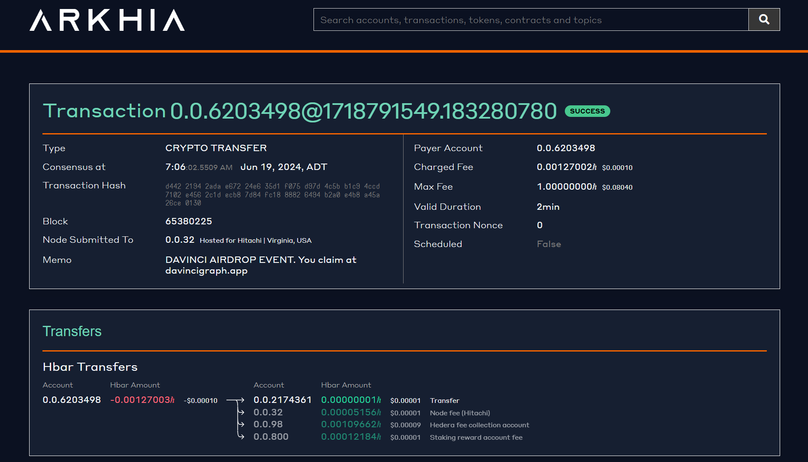
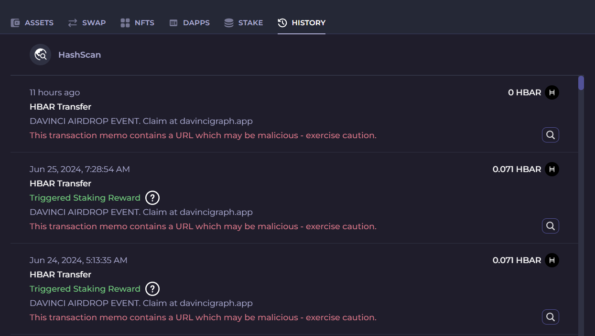

# Beware of Phishing Scams Using HBAR Transactions!

Scammers are continuously evolving their tactics to exploit unsuspecting cryptocurrency holders. One emerging scam involves the use of Hedera Hashgraph (HBAR) transactions. Here's how it works and how you can protect yourself.

## How It Works:

Scammers may send you a small amount of HBAR along with a memo containing a link to a scam website. These memos often advertise fake airdrop events, tricking you into visiting the fraudulent site and potentially connecting your wallet, leading to theft of your assets.

### Example:

An unsuspecting crypto user received a small HBAR transaction with a memo promoting a "DAVINCI AIRDROP EVENT" at a seemingly legitimate website, davincigraph.app. Intrigued by the potential free tokens, the user visited the site, connected their wallet, and ended up losing access to their assets.

davincigraph.io is the official DaVinciGraph Website!

## Protection Tips:

### Ignore Suspicious Transactions:

If you receive an unexpected transaction with a memo, do not click on any links or visit the suggested websites.

### Verify Official Channels:

Always verify the legitimacy of any event or airdrop through official channels such as the project's official website or social media accounts.

### Report Suspicious Activity:

If you encounter such scams, report them to the relevant authorities and inform the official project team to help warn others.

## Examples of Scam Memos:

- **"DOVU AIRDROP EVENT. You claim at dovuhub. com"**
- **"DAVINCI AIRDROP EVENT. You claim at davincigraph. аpp"**

These memos can look very convincing, often mimicking legitimate events. Always double-check URLs and be aware that scammers frequently use subtle misspellings or different domain extensions to deceive you.

## Summary:

- **Stay Vigilant:** Be cautious of unsolicited offers and transactions.
- **Verify Information:** Use official sources to verify any claims.
- **Report Scams:** Help the community by reporting suspicious activities.

Protect your crypto by staying informed and vigilant!

[Previous: Essential Security Practices for Safe Crypto Transactions and Storage](./03-essential-security-practices-for-safe-crypto-transactions-and-storage.md)

[Next: Protect Yourself Against Crypto Phishing Scams](./05-protect-yourself-against-crypto-phishing-scams.md)
