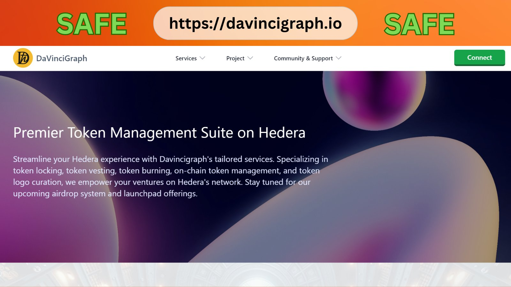
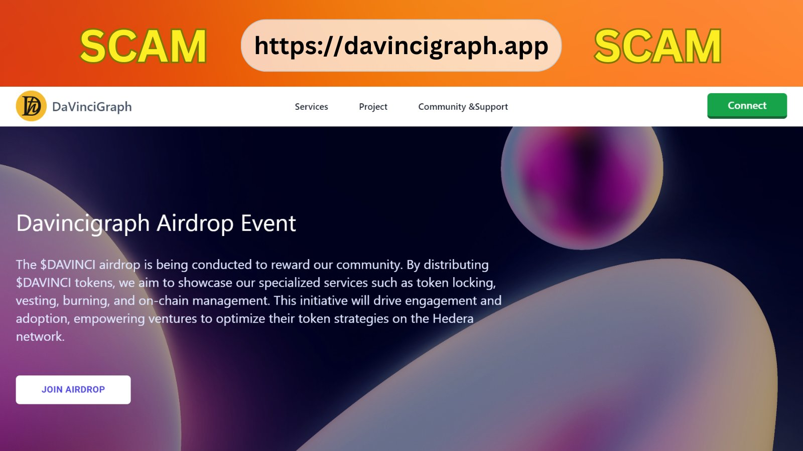
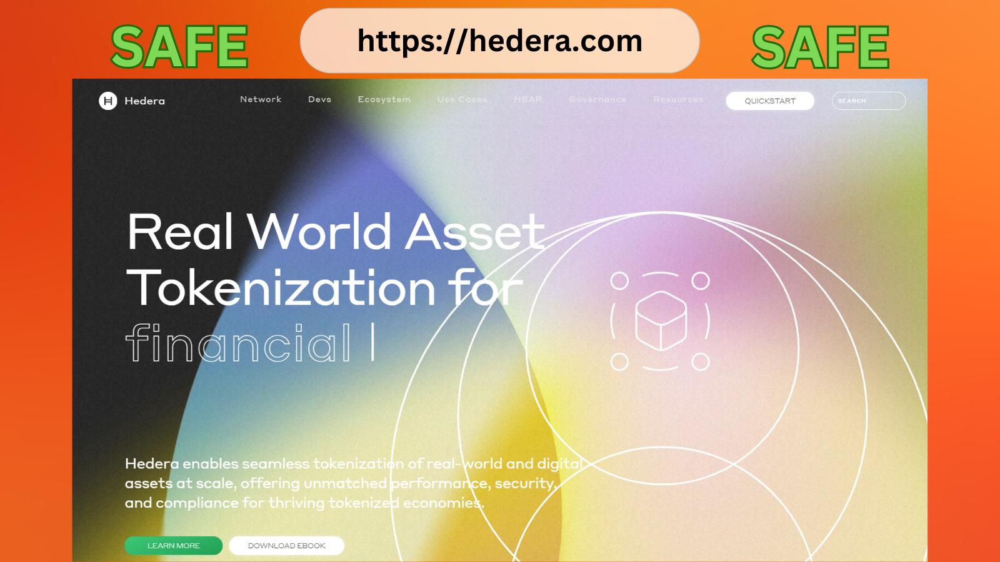
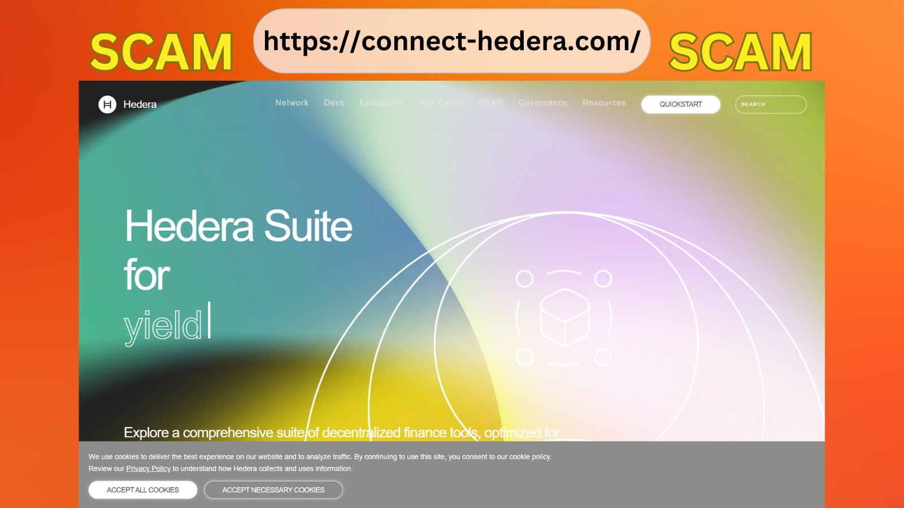
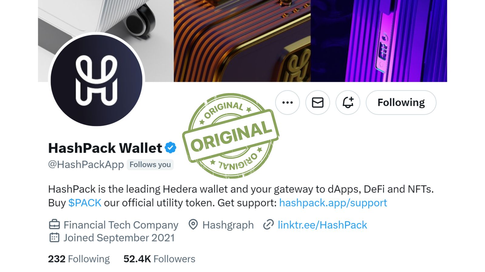
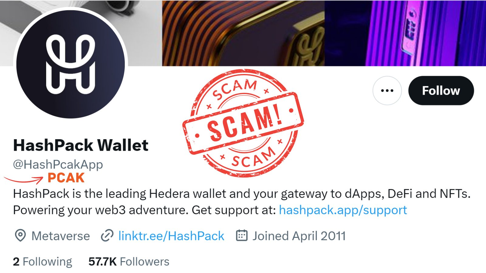
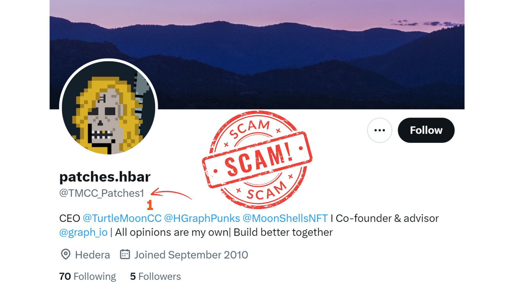

# Protect Yourself from Crypto Phishing Scams

In the rapidly evolving world of cryptocurrency, staying vigilant against potential scams is crucial. This guide focuses on how to identify and avoid phishing attempts, particularly on popular platforms like Discord and Telegram.

## Understanding Phishing Scams

Phishing scams in the crypto world typically involve:

- Fake websites mimicking legitimate exchanges or wallet services
- Fraudulent emails or messages asking for sensitive information
- Social engineering tactics to gain trust and exploit users

## Common Phishing Tactics

### 1. Admin/Mod Impersonation

Scammers often pose as admins or moderators in crypto-related channels or groups.

### 2. Unsolicited Direct Messages

Be wary of unexpected private messages, especially those offering help or exclusive opportunities.

### 3. Fake Websites

Scammers create convincing replicas of legitimate crypto sites to steal login credentials or private keys.

### Example 1: DaVinciGraph

- Legitimate Site: `DaVinciGraph.io` ✅
  - Provides tools for Hedera projects to launch and grow

- Scam Site: `DaVinciGraph.app` ☠️
  - Copies the legitimate site's landing page
  - Offers fake airdrops
  - Attempts to drain funds when users connect their wallets

### Example 2: Hedera

- Legitimate Site: `hedera.com` ✅

- Scam Site: `connect-hedera.com` ☠️
  - Mimics the hedera interface

### 4. Phishing Emails

Emails that appear to be from reputable sources but contain malicious links or attachments.

### 5. Fake Social Media Accounts

Scammers create fake accounts with minor alterations to the username to mimic legitimate ones.

### Example 1: HashPack

- Legitimate page: `@HashPackApp` ✅

- Scam page: `@HashPcakApp` ☠️
  - Swaps 'C' and 'A' to mimic the real HashPack username.
  - Copies the legitimate page
  - Offers fake airdrops
  - Attempts to drain users funds

### Example 2: Patches

- Legitimate page: `@TMCC_Patches` ✅

- Scam page: `@TMCC_Patches1` ☠️

  - Adds a '1' to the end of the username.

    

## Protection Tips

1. Always double-check the URL of any website you visit
2. Never click on links from unsolicited emails or messages
3. Use two-factor authentication (2FA) for an added layer of security
4. Verify the identity of anyone claiming to be an admin or mod
5. Be cautious of unsolicited DMs, even from apparent authority figures
6. Never share your private keys or login credentials
7. Use hardware wallets for storing significant amounts of cryptocurrency

## Red Flags to Watch For

- Urgent requests for action or information
- Promises of unrealistic returns or exclusive opportunities
- Pressure to make quick decisions
- Requests to send cryptocurrency for "verification" purposes
- Poor grammar or spelling in official-looking communications

## Best Practices

1. Use official websites by typing the URL directly into your browser
2. Keep your software and antivirus programs up to date
3. Use strong, unique passwords for each of your accounts
4. Enable notifications for all transactions in your wallet or exchange accounts
5. Regularly review your account activity for any suspicious transactions

## Staying Informed

- Follow official project accounts on social media for updates and warnings
- Join reputable crypto communities to stay updated on the latest scams
- Regularly educate yourself on new phishing techniques and security best practices

Remember, in the world of cryptocurrency, if something seems too good to be true, it probably is. Stay vigilant, trust your instincts, and always prioritize the security of your assets.

[Previous: Beware of Phishing Scams Using HBAR Transactions](./04-beware-of-phishing-scams-using-hbar-transactions.md)
